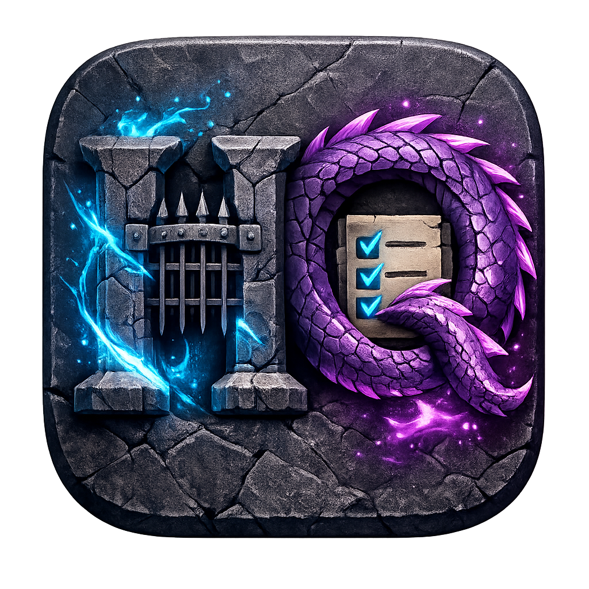

# ⚔️ HabitQuest RPG - Level Up Your Life


> **"Gamify your life. Turn habits into monsters, earn XP, and become the hero of your own story."**

---

## 🌟 Live Demo
👉 **[Play HabitQuest Now](https://habitquest-tau.vercel.app/)** 

---

## 🖼️ Screenshots
| **Dashboard (Midnight Theme)** | **Avatar Evolution Shop** |
|:---:|:---:|
|  

| **Focus Battle Mode** | **Victory & Journal** |
|:---:|:---:|
|  

---

## 🚀 Key Features

### 🎮 RPG Mechanics
- **Quest System:** Turn daily tasks into quests.
- **XP & Leveling:** Gain Experience (XP) to level up your character.
- **Health System:** Failing a habit damages your HP. Don't die!
- **Gold Economy:** Earn gold to buy new Avatars.

### 🦁 Avatar Evolution
- **Unlockable Heroes:** Buy different heroes (Ninja, Mage, Cyborg).
- **Evolution Stages:** Heroes visually evolve at **Level 10** and **Level 20**.

### 🔥 Productivity Tools
- **Focus Mode:** A built-in Pomodoro timer to battle quests. (2x XP Reward!)
- **Battle Chronicles:** A history journal that tracks your Victories and Defeats.
- **Streak Counter:** Build momentum with daily streaks.

### ☁️ Tech & Cloud
- **Google Login:** Secure authentication via Firebase.
- **Cloud Save:** Never lose your progress. Syncs across devices.
- **PWA Ready:** Installable on mobile devices (Add to Home Screen).
- **Themes:** Cyberpunk Neon, Royal Gold, and Midnight Blue modes.

---

## 🛠️ Tech Stack

- **Frontend:** React.js (Vite), Framer Motion (Animations)
- **Styling:** Tailwind CSS, Lucide React (Icons)
- **Backend/BaaS:** Firebase (Authentication, Firestore Database)
- **Hosting:** Vercel

---

## 💻 Installation & Setup

Want to run this locally? Follow these steps:

1. **Clone the repo**
   ```bash
   git clone [https://github.com/argtiwari/habitflow.git](https://github.com/argtiwari/habitflow.git)
   cd habitquest-rpg
Install Dependencies

Bash

npm install
Firebase Setup

Create a project on Firebase Console.

Enable Authentication (Google) and Firestore Database.

Create a file named src/firebase.js and add your config keys.

Run the Server

Bash

npm run dev
👤 Author
[Argcoding]

🌐 Portfolio:  https://my-interactive-resume-two.vercel.app/

🐙 GitHub: [@argtiwari](https://github.com/argtiwari)

📸 Instagram: [@argCoding](https://www.instagram.com/argcoding)

🤝 Contributing
Contributions, issues, and feature requests are welcome! Feel free to check the issues page.

Made with ❤️ and Code by [Argcoding]